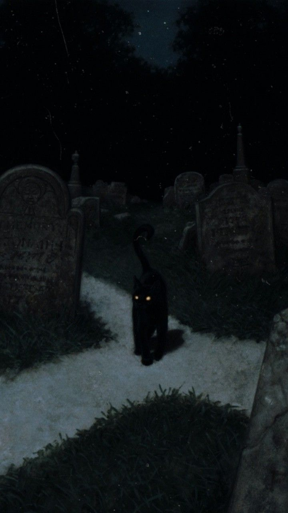
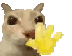

  

    
  

<!--  -->
<!---->

----

  

<code>> ~/xzinl $ whoami</code>

Fala! Eu sou o <b>xzinl</b> 
    
  Sou <b>Full Stack Developer</b> e gosto de mexer com praticamente tudo que envolve desenvolvimento. Não curto ficar preso em uma tecnologia só — gosto de entender como as coisas funcionam por trás e ir testando até fazer dar certo.
    
  No <b>Front-end</b>, trabalho com <b>HTML, CSS, JavaScript e React</b>, buscando criar interfaces que sejam bonitas, rápidas e realmente funcionem bem. No <b>Back-end</b>, desenvolvo <b>APIs, sistemas, autenticação, integrações e automações</b> usando principalmente <b>Node.js, Python e Java</b>. Também trabalho com <b>bancos de dados, Git, servidores e deploy</b>
    
  Gosto especialmente de pegar uma ideia que existe só na cabeça e transformar em um sistema completo e utilizável. Por isso, meus projetos normalmente envolvem várias partes do desenvolvimento ao mesmo tempo.
    
  Também curto bastante <b>Cybersecurity</b>, automações, inteligência artificial e criação de sistemas. Muitos dos meus projetos começam simplesmente com uma ideia aleatória e terminam virando alguma coisa que eu realmente consigo usar no dia a dia.
    
  Ainda estou aprendendo pra caralho e provavelmente sempre vou estar. Pra mim, programar é justamente isso: <b>quebrar, pesquisar, testar, consertar e aprender no processo.</b>
    
  

status: building something…

>

† ʳᵉᵐᵉᵐᵇᵉʳ ʸᵒᵘ ʷⁱˡˡ ᵈⁱᵉ †
  
ₘₑₘₑₙₜₒ ₘₒᵣᵢ
  

☾ ─────────────── † ─────────────── ☽

 

  
<h3>𝔰𝔱𝔞𝔠𝔨</h3>

 

---

 <!--- <h3>𝔰𝔱𝔞𝔱𝔰</h3>

<!---  -->

<h3>𝔫𝔦𝔤𝔥𝔱𝔣𝔞𝔩𝔩 𝔭𝔯𝔬𝔱𝔬𝔠𝔬𝔩</h3>

  

live telemetry + public language spectrum · automatically regenerated every night · <a href="https://github.com/duartess7/nightfall-metrics">source & authorship</a>

  

<h3>𝔫𝔦𝔤𝔥𝔱𝔣𝔞𝔩𝔩 𝔰𝔢𝔯𝔭𝔢𝔫𝔱</h3>

  

powered by <a href="https://github.com/Platane/snk">Platane/snk</a> · Nightfall palette · refreshed daily · <a href="https://github.com/duartess7/nightfall-snake">configuration</a>

  

